  

## 📌 About Me
- 👨‍💻 Ingeniero de Desarrollo y Gestión de Software.
- 🏗️ Especializado en el ecosistema Laravel (PHP + MySQL).
- 🗄️ Experiencia trabajando con bases de datos como SQL Server y PostgreSQL.
- 💻 Familiarizado con el desarrollo en C# y Java.
- 🔌 Entusiasta del hardware (ESP32) y la reparación de equipos.
- 🎓 Interesado en la Maestría en Tecnología Educativa.

## 🧠 My Focus Areas
- 🏗️ Arquitectura de Software: Desarrollo de sistemas robustos con PHP y Laravel.
- 🗄️ Gestión de Datos: Modelado y administración en MySQL, SQL Server y PostgreSQL.
- 💻 Desarrollo Multiplataforma: Experiencia en entornos C#, Java y Web.
- 🎓 Tecnología Educativa: Implementación de soluciones digitales para el aprendizaje.
- 🤖 Internet de las Cosas (IoT): Integración de microcontroladores ESP32 con APIs de IA.

## 📊 GitHub Stats & Trophies

  
  

  

  

  

## 🛠️ Languages & Tools

> ## Programming Languages

    

> ## Frontend

   

> ## Backend

 

> ## Database

  

> ## Tools

 

  

<picture>
  <source media="(prefers-color-scheme: dark)" srcset="https://raw.githubusercontent.com/abozanona/abozanona/output/pacman-contribution-graph-dark.svg">
  <source media="(prefers-color-scheme: light)" srcset="https://raw.githubusercontent.com/abozanona/abozanona/output/pacman-contribution-graph.svg">
  
</picture>

